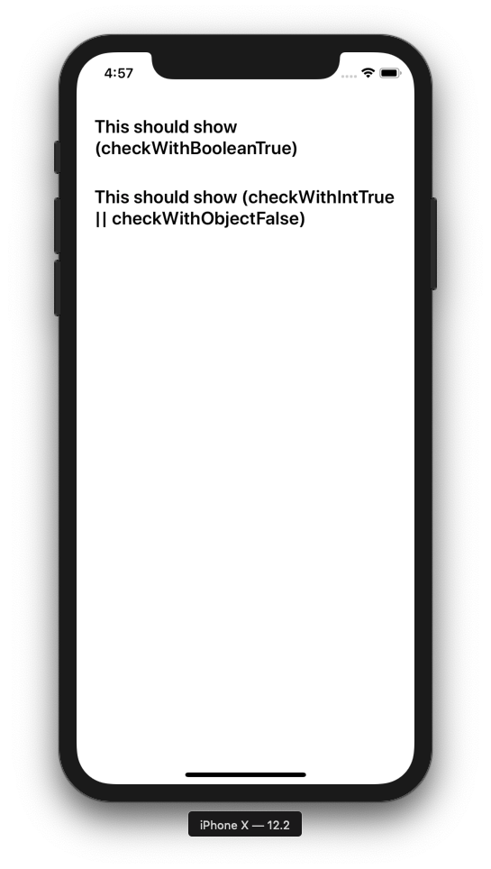

# react-native-optional
[](https://badge.fury.io/js/react-native-picker-select)

A react native utility to render component(s) conditionally in JSX.

This functionality was developed by [Greg Herlihy](https://github.com/greghe), and modified and open-sourced by [Rupal Totale](https://github.com/rupaltotale/) at [Skillz](https://www.skillz.com/). 

## Getting Started

### Installation

In your react native app directory, run the following command:

`npm install react-native-optional`

### Basic Usage

```js
import Optional from 'react-native-optional';

export default class Example extends Component {
  const check = true;
  return (
    <Optional test={check}>
      <Text>Hello World</Text>
    </Optional>
  );
};
```

### Involved Example

```js
import React from 'react';
import {StyleSheet, View, Text} from 'react-native';

// The below import is not needed but it is is recommended to include it
import Optional from 'react-native-optional';

const App = () => {
  const checkWithBooleanTrue = true;
  const checkWithBooleanFalse = false;
  const checkWithIntTrue = 1;
  const checkWithObjectFalse = null;
  return (
    <View style={styles.sectionContainer}>
      <Optional test={checkWithBooleanTrue}>
        <Text style={styles.sectionTitle}>
          This should show (checkWithBooleanTrue)
        </Text>
      </Optional>

      <Optional test={checkWithBooleanFalse}>
        <Text style={styles.sectionTitle}>
          This should NOT show (checkWithBooleanFalse)
        </Text>
      </Optional>

      <Optional test={checkWithIntTrue || checkWithObjectFalse}>
        <Text style={styles.sectionTitle}>
          This should show (checkWithIntTrue || checkWithObjectFalse)
        </Text>
      </Optional>

      <Optional test={checkWithIntTrue && checkWithObjectFalse}>
        <Text style={styles.sectionTitle}>
          This should NOT show (checkWithIntTrue && checkWithObjectFalse)
        </Text>
      </Optional>
    </View>
  );
};

const styles = StyleSheet.create({
  sectionContainer: {
    marginTop: 50,
    padding: 20,
  },
  sectionTitle: {
    fontSize: 20,
    fontWeight: '600',
    marginBottom: 30,
  },
});

export default App;
```

### Props

| Name                                            | Description                                                                                                                                                                                                                                                                                                                                                                                                                                                                                             | Details                  |
| ----------------------------------------------- | ------------------------------------------------------------------------------------------------------------------------------------------------------------------------------------------------------------------------------------------------------------------------------------------------------------------------------------------------------------------------------------------------------------------------------------------------------------------------------------------------------- | ------------------------ |
| `test`                                 | Rendering of the child component(s) of ```<Optional>``` depends on the "truthiness" this prop's value.                                                                                                                                                                                                                                                                                                                                                                                                                                                                   | **required**<br>boolean |

| `test`                                 | Rendering of the child component(s) of ```<Optional>``` depends on the "truthiness" this prop's value.                                                                                                                                                                                                                                                                                                                                                                                                                                                                   | **required**<br>boolean |
## How it works

The straightforward approach to tackling this issue is to create an Optional class that builds a Optional component with children components regardless of whether the test passes or fails. However, this hampers time and space performance as when the test fails (it has a falsy value), a useless Optional component and its subcomponents have been constructed despite not being displayed.
  
To overcome this shortcoming of constructing an Optional component and its children components when they don't need to be created, the custom babel plugin reverses the order of events. When the code is being transformed, upon encountering a Optional component, it first checks the value of its test prop and only if it evaluates to true, it allows for the creation of the subcomponents. Otherwise, it skips past the Optional component.
  
To summarize, this plugin transforms:
```
  <Optional test={test}>
      <Child>
        ...
      </Child>
  </Optional>
```
  to: 
```
  {Boolean(test) && <Child>...</Child> }
```
